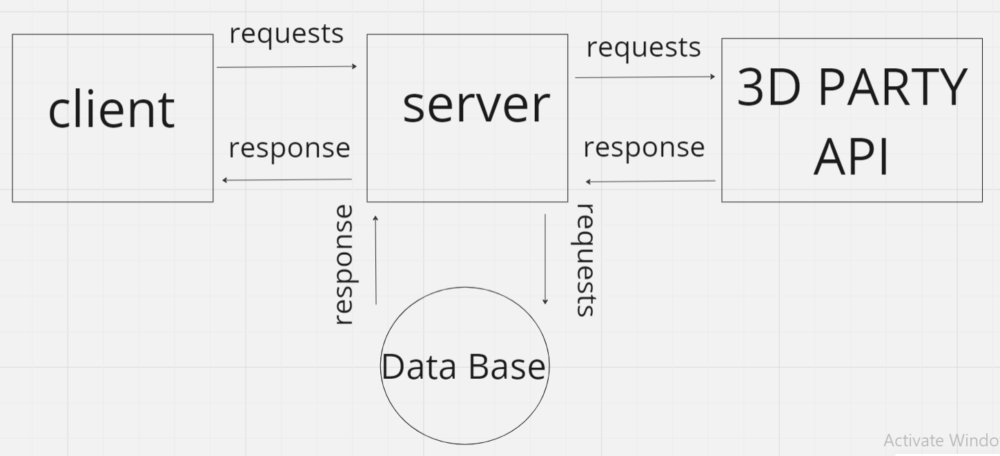

# Project Name - Movies-Library lab 11

**Author Name**: Yazan Bargothi

## WRRC

## Overview

## Getting Started
1-Clone the Repository:
2-Initialize Project: Run npm init -y
3-Install Dependencies: by running npm install express cors.
4-Create Basic File Structure: server.js , .gitignore , .eslintrc
5-Build Routes:
6-Handle Errors:

## Project Features
Home Page Endpoint (/): Display information about a specific movie.
    Favorite Page Endpoint (/favorite): Display a welcome message for the favorite page. 
